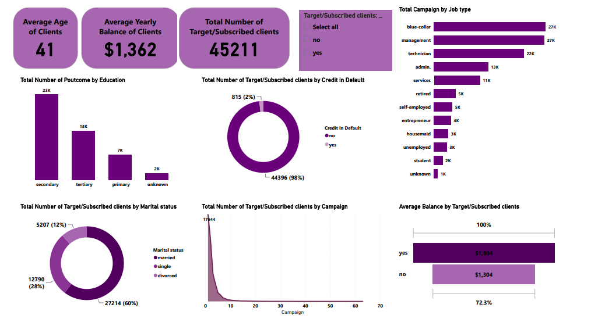
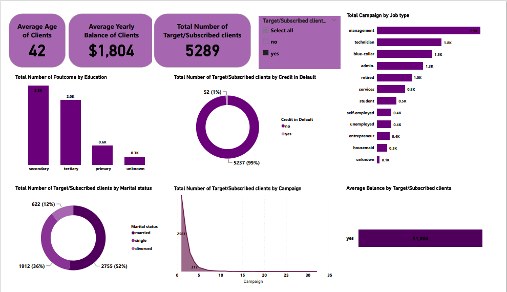
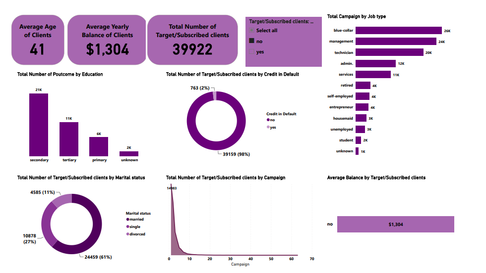
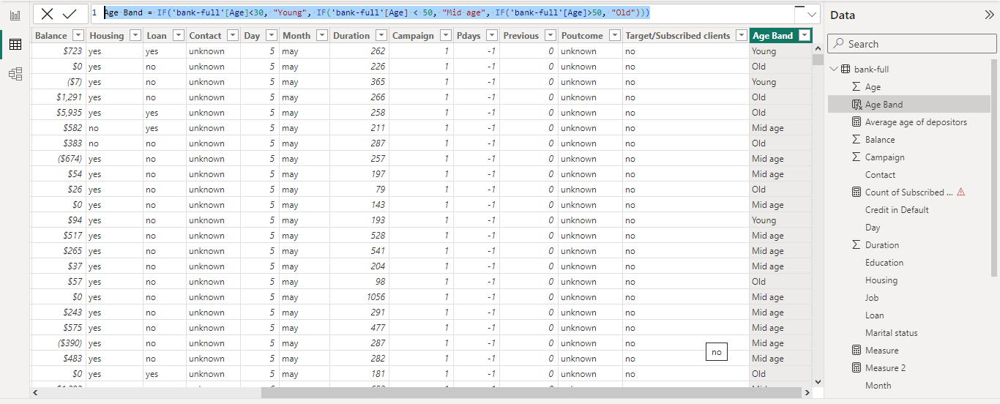
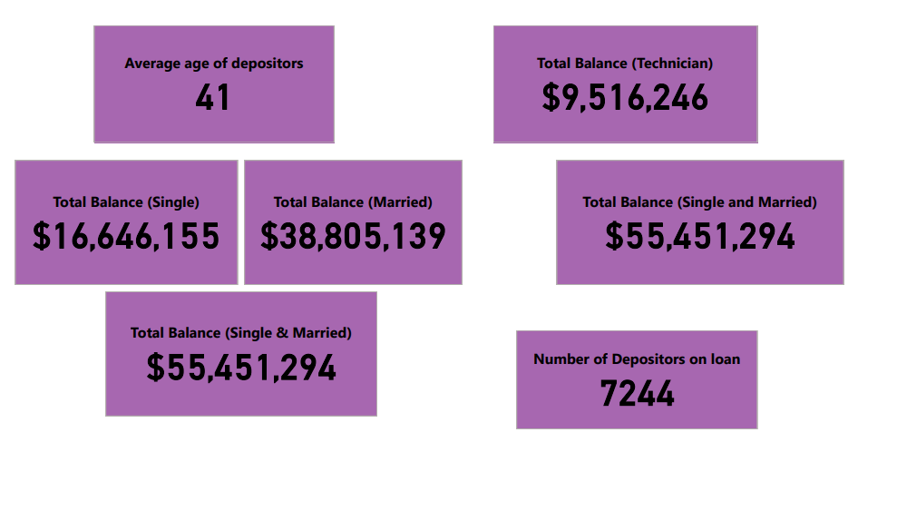

# Early Steps with Power BI - Dashboard and DAX

---

## Introduction

Data visualization is an important aspect in Power BI that enhances understanding of data, communication of insights, and decision-making based on generated insights; by representing data graphically in visually appealing and easily understandable manner. 

In this task, an interactive dashboard by combining multiple visualizations with each telling its own story. The data used for this dashboard creation is Bank deposit dataset(https://github.com/SeunA88/Early-steps-with-Power-BI-Dashboard-and-DAX/blob/main/bank-full.csv). It basically contains information about bank depositors/clients such as name, age, marital status, age, credit history, loan history as well as other inportant information. Also, the  data details the diffrent bank campaigns carried alongside their outcomes with each depositors/clients.

## Creating the Dashboard

In creating the dashboard, some data were selected to aid the understandng of the data and to bring out some insights from the data. The following data were focussed on and visualised in the dashboard. 

- Average age of the bank clients/depositors: This gives an insight into the average age of depositors at the bank and informed decisions can be made as to what age range can be focussed on when campaigning to clients about new bank term deposits. From the data, it can be seen that 41 years is the average age of the bank depositors.
  
- Average yearly balance of the bank clients/depositors: This gives an insight into the average yearly balance of the bank depositors and can also be used to narrow down campaign focus to prospective clients. From the data, it can be seen that $1,362 is the average yearly balance of the bank depositors.
  
- Total number of subscribed/target clients : An insight into how many of the clients/ depositors subscribed to the term deposits after campaigns, and also which clients havent subscribed but are still potential targets.
  
- Total campaign by job type: 
- Total number of poutcome by education
- Total number of subscribed/target clients by credit in default
- Total number of subscribed/target clients by marital status
- Total number of subscribed/target clients by campaign and
- Average balance by subscribed/target clients
- A slicer was added to the dashboard to help in filtering the subscribed/target clients. When filter is selected as 'yes" or "no", data can be compared across the dashboard and an insight into a summary/update of the success of the campaign projects can be visualised.

#### Please find below the dashboard created.
#### Representing all data.

#### Filtered to only Bank term deopsit Subscribed clients

#### Filtered to only clients who haven't subscribed yet

---

#### In the following task, Data Analysis Expressions (DAX), which is designed to perform calculations, create custom measures, and manipulate data, was used to perform the following calculations from the same data (https://github.com/SeunA88/Early-steps-with-Power-BI-Dashboard-and-DAX/blob/main/bank-full.csv).

1). A measure for the ‘Average age of depositors’

2). A new column named ‘Age band’ containing the following;
    ‘Young’ for ages below 30
     ‘Mid-aged’ for ages between 30 and 50
     ‘Old’ for ages above 50
     
3). A measure calculating the total balance for:
    Job: Technician
    Marital: Single and Married
    
4). A measure to get the number of depositors on Loan

#### The following DAX was used to answer the questions above.

- Average age of depositors = AVERAGE('bank-full'[Age])

- Age Band = IF('bank-full'[Age]<30, "Young", IF('bank-full'[Age] < 50, "Mid age", IF('bank-full'[Age]>50, "Old")))
  
- Total Balance (Technician) = CALCULATE(SUM('bank-full'[Balance]),'bank-full'[Job]="technician")
 
- Total Balance (Married) = CALCULATE(SUM('bank-full'[Balance]), ('bank-full'[Marital status] = "married"))

- Total Balance (Single) = CALCULATE(SUM('bank-full'[Balance]), 'bank-full'[Marital status] = "single")

- Total Balance (Single & Married) = CALCULATE([Total Balance (Married)] + [Total Balance (Single)])
  
  Alternatively, a single calculated measure can be used, see below:
  
- Total Balance (Single and Married) = CALCULATE(SUM('bank-full'[Balance]),('bank-full'[Marital status] = "single") + ('bank-full'[Marital status] = "married"))

- Number of Depositors on loan = CALCULATE(COUNT('bank-full'[Loan]), 'bank-full'[Loan] = "yes")
  

  #### The results of each calculation is shown below:

  

  

  ---

  ## Conclusion
In the two tasks above, Data visulaization tools and DAX were used to communicate insights that can be useful in targeting and focussiing on specific client types and campaigns that can help in maximizing the number of prospective clients to sign up for term deposits with the bank.

